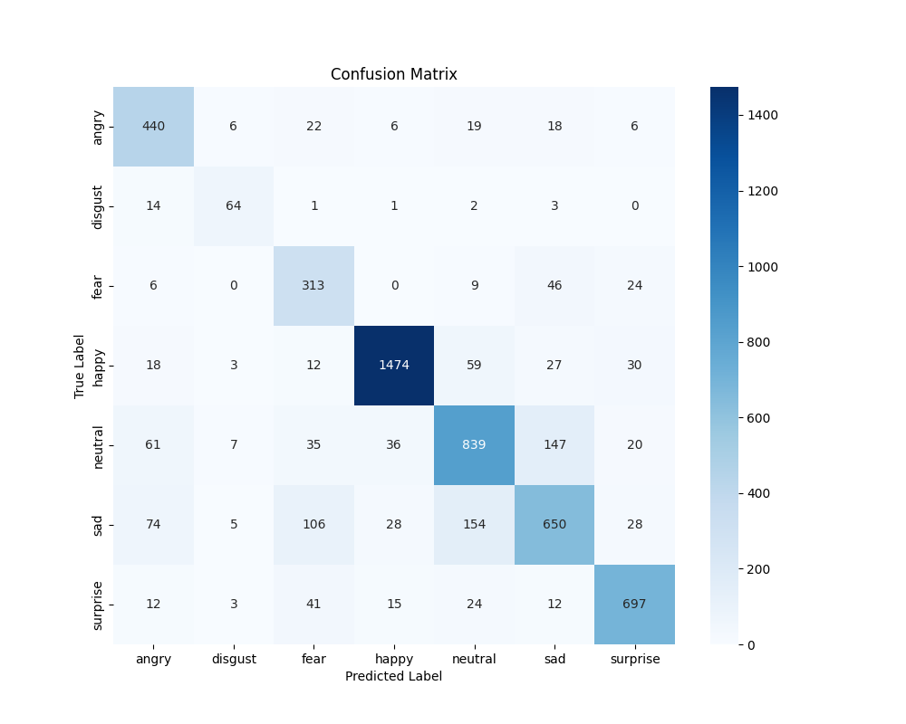
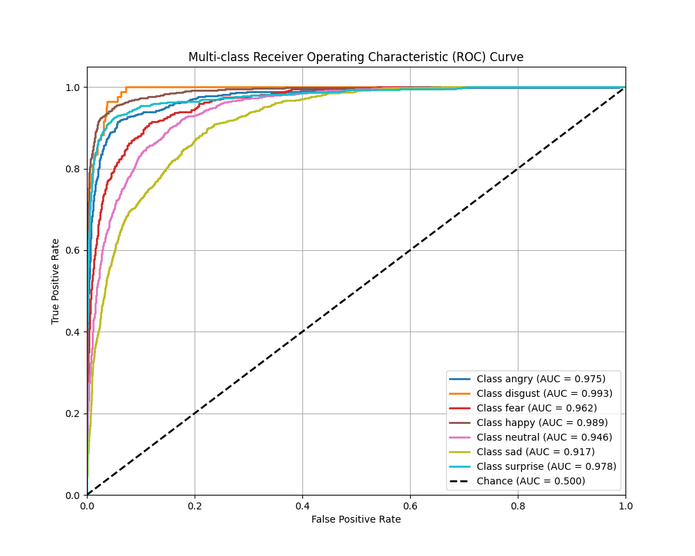

# Explainable AI (XAI) for Real-Time Emotion Detection

This project is an end-to-end deep learning application that detects human emotions from a live webcam feed.

Its key feature is **Explainable AI (XAI)**. The application doesn't just tell you *what* emotion it sees (e.g., "Happy")—it also shows you *why* by overlaying a real-time **Grad-CAM heatmap**. This heatmap highlights the specific facial features, like the curve of a mouth or the crinkles around the eyes, that the model used to make its decision.

This project uses **PyTorch** for deep learning and **OpenCV** for real-time video processing.

## Demo

<table>
  <tr>
    <td align="center">
      <br>
      <sub><b>Angry<br>(Confidence: 99.5%)</b></sub>
    </td>
    <td align="center">
      <br>
      <sub><b>Disgust<br>(Confidence: 100%)</b></sub>
    </td>
    <td align="center">
      <br>
      <sub><b>Fear<br>(Confidence: 51.6%)</b></sub>
    </td>
    <td align="center">
      <br>
      <sub><b>Happy<br>(Confidence: 98.8%)</b></sub>
    </td>
    <td align="center">
      <br>
      <sub><b>Neutral<br>(Confidence: 88.8%)</b></sub>
    </td>
    <td align="center">
      <br>
      <sub><b>Sad<br>(Confidence: 72.6%)</b></sub>
    </td>
    <td align="center">
      <br>
      <sub><b>Surprise<br>(Confidence: 95.8%)</b></sub>
    </td>
  </tr>
</table>

*Grad-CAM heatmaps at native 48×48 FER-2013 resolution. The model correctly attends to nose/mouth regions for Disgust and Happy, and eye/brow regions for Angry.*


## Results

Evaluated on the FER-2013 test set (5,617 images, 7 emotion classes):

- **Overall accuracy: 79.7%**
- **Weighted F1-score: 0.798**
- **Real-time inference: ~8–10 FPS** on an NVIDIA MX450 GPU

| Emotion  | Precision | Recall | F1-score |
|----------|-----------|--------|----------|
| Angry    | 0.704     | 0.851  | 0.771    |
| Disgust  | 0.727     | 0.753  | 0.740    |
| Fear     | 0.591     | 0.786  | 0.675    |
| Happy    | 0.945     | 0.908  | 0.926    |
| Neutral  | 0.759     | 0.733  | 0.745    |
| Sad      | 0.720     | 0.622  | 0.667    |
| Surprise | 0.866     | 0.867  | 0.866    |

Trained for 50 epochs on an NVIDIA MX450 GPU, using class-weighted loss to handle FER-2013's natural class imbalance (Disgust is ~7x rarer than Happy).

**Note on FPS:** Grad-CAM requires a full backward pass in addition to the forward pass, and Haar Cascade face detection runs on CPU — both add overhead beyond plain classification speed. Classification-only inference (no Grad-CAM) would run significantly faster.

Full training and evaluation logs (including the full classification report) are available in [`logs/`](logs/).

<p align="center">
  
  
</p>


## 📋 Features

* **Real-Time Emotion Classification:** Identifies 7 different emotions (Angry, Disgust, Fear, Happy, Neutral, Sad, Surprise) from a live webcam feed.
* **Explainable AI (XAI):** Implements **Grad-CAM** (Gradient-weighted Class Activation Mapping) to generate a visual, real-time heatmap of *why* the model is making a certain prediction.
* **Deep CNN Architecture:** Uses a custom VGG-style `EmotionCNN` model with 4 convolutional blocks and 3 classifier layers.
* **Advanced Training:** The training script handles highly imbalanced datasets (like FER-2013) by automatically calculating and applying **class weights** to the loss function.
* **Face Detection:** Uses OpenCV's robust Haar Cascade classifier to accurately detect and crop faces from the video stream.

## 🛠️ How It Works

The `realtime_gradcam.py` script follows a clear, step-by-step process for every frame of the video:

1.  **Capture Frame:** Grabs a frame from the webcam.
2.  **Detect Face:** Uses the `haarcascade_frontalface_default.xml` file to find the (x, y, w, h) coordinates of a face.
3.  **Crop & Preprocess:** Extracts the face, converts it to grayscale, resizes it to 48x48, and transforms it into a PyTorch tensor.
4.  **Inference:**
    * The main `model` performs a fast prediction to get the final emotion label (e.g., "Happy", "Sad" etc.).
5.  **Explanation:**
    * A `gradcam_model` runs a full forward and backward pass.
    * **Hooks** are attached to the last convolutional layer (`conv_block4`) to "catch" the internal feature maps and gradients.
    * These are combined to create the Grad-CAM heatmap, which shows the "importance" of each pixel for the final decision.
6.  **Display:** The script draws the heatmap (blended with the original face), the bounding box, and the predicted label onto the video frame.

---

## 📁 File Structure

* **`emotion.py`**: The **Training Script**. This file contains the complete pipeline to train your `EmotionCNN` model from scratch. It loads the `train` and `test` directories, calculates class weights for imbalance, and saves the best-performing model as `bestModelOnCleanDataset_1.pth`.
* **`realtime_gradcam.py`**: The **Main Application**. This is the script you run for the live demo. It loads a pre-trained model and performs real-time, explainable emotion detection.
* **`haarcascade_frontalface_default.xml`**: A pre-trained classifier from OpenCV. It is **required** to detect the location of faces in the video.
* **`bestModelOnCleanDataset_1.pth`**: The saved model weights created by `emotion.py`.
* **`assets/`**: Demo images, confusion matrix, and ROC curve.
* **`logs/`**: Full training and evaluation logs.

---

## ⚙️ Setup & Installation

To run this project, you need Python and the following libraries.

1.  **Install Dependencies:**
    ```bash
        pip install -r requirements.txt
    ```

2.  **Get Project Files:**
    Ensure all three files (`emotion.py`, `realtime_gradcam.py`, `haarcascade_frontalface_default.xml`) are in the same directory.

3.  **Prepare the Model:**
    * If you have already trained the model, ensure `bestModelOnCleanDataset_1.pth` is in the folder.
    * If you haven't trained it yet, run the training script first (see below).
     ```bash
      python emotion.py
      ```
